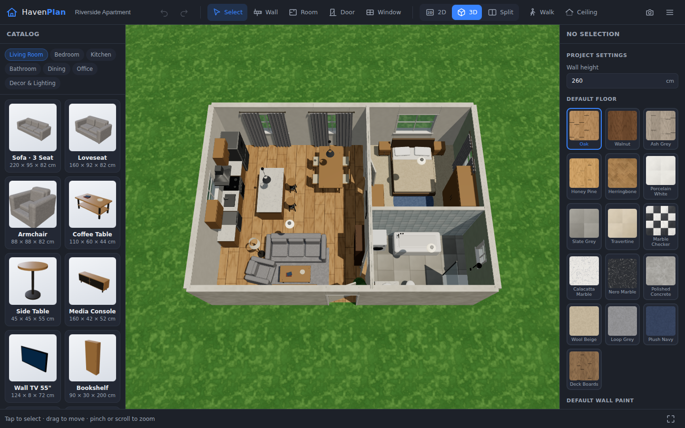

# HavenPlan — Home Design Studio

A professional 2D/3D home design application in the spirit of Planner 5D,
built for the browser and fully touch-optimized for phones and tablets.
It ships with **zero binary assets** — every floor, wall finish, fabric and
piece of furniture is generated procedurally at runtime.



## Features

**Floor planning (2D)**
- Draw walls point-to-point with grid, endpoint, and 45° angle snapping
- One-drag rectangular room tool
- Automatic room detection (planar face tracing with T-junction splitting),
  live area labels and per-wall dimensions in meters
- Hinged doors (with flip/hinge-side controls and swing arcs), doorways,
  sliding doors, and windows with adjustable width/height/sill
- Architectural top-view symbols for every catalog item
- Drag to move, handles to rotate and resize, keyboard shortcuts
  (`R` rotate, `Del` delete, `Ctrl+Z/Y` undo/redo, `Esc` cancel)
- Pan with drag, zoom with wheel or pinch — full multi-touch support

**Real-time 3D**
- Textured walls that are painted per room (each wall face takes the
  material of the room it looks into), cut open for doors and windows
- Full 3D door/window models: frames, panels, handles, glass, mullions
- Per-room floor materials, optional ceilings, exterior lawn
- Sun + sky lighting with soft shadows, ACES tone mapping
- Orbit controls and a first-person **walk mode** (WASD + drag to look)
- Select and drag furniture directly in 3D
- One-click PNG snapshots of the 3D view

**Catalog — 45+ parametric models**
Living room (sofas, armchair, media console, bookshelf with books, rugs,
fireplace, floor lamp), bedroom (beds, wardrobe, dresser, nightstand),
kitchen (cabinets, island, fridge, range cooker, hood, dishwasher, washer,
bar stool), bathroom (bathtub, shower, vanity, toilet, mirror), dining,
office, plus decor & lighting (plants, pendant/ceiling lights that actually
emit light, curtains, wall art). Catalog thumbnails are real renders of the
3D models; many items offer fabric/wood finish palettes.

**Materials**
40+ procedural PBR-style materials with color + bump maps: oak, walnut,
herringbone parquet, porcelain/slate/travertine tile, Calacatta and Nero
marble, polished concrete, carpets, subway tile, exposed and painted brick,
wall paints, wallpapers, fabrics, stone countertops, lawn.

**Projects**
- Autosave to the browser (localStorage)
- Download / open project files (`.havenplan.json`)
- Furnished sample apartment included

## Run it

```bash
npm install
npm run dev        # development server (add --host for LAN/mobile testing)
npm run build      # production build in dist/
npm run preview    # serve the production build
```

Open the printed URL. On a phone, use the bottom-bar **Catalog** and
**Details** buttons; two fingers pan/zoom the plan.

## Architecture

```
src/
├── core/
│   ├── state.js        # project model, undo/redo, autosave, events
│   ├── geometry.js     # vector math, planar-graph room detection
│   └── textures.js     # procedural texture engine + material registry
├── catalog/
│   ├── builders.js     # primitive helpers for parametric furniture
│   └── items.js        # the 45+ item definitions (3D + plan symbol + palettes)
├── editor/
│   ├── editor2d.js     # canvas floor-plan editor (mouse/touch/pen)
│   └── plansymbols.js  # architectural top-view symbols
├── viewer/
│   ├── arch3d.js       # walls/floors/ceilings/openings mesh construction
│   └── viewer3d.js     # scene, lighting, controls, walk mode, 3D dragging
└── ui/                 # toolbar, catalog, properties, icons, thumbnails
```

Units are centimeters throughout. The only runtime dependency is
[three.js](https://threejs.org).
